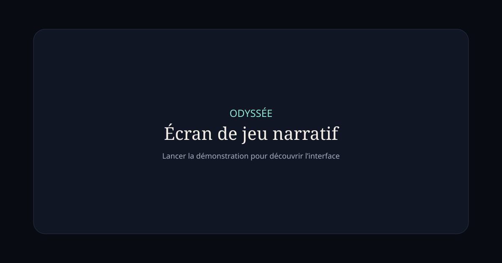

# Projet Odyssée

Application narrative coopérative pour deux joueurs. Les joueurs écrivent librement l’histoire ; l’IA arbitre et préserve sa cohérence sans imposer de scénario ni de fin.



## Fonctionnalités

- inscription, connexion, session et routes protégées ;
- création/rejointure par code et salon à deux places ;
- univers, ton, limites et modes libre/temps réel ;
- formulaire et aperçu de personnage ;
- objectifs personnels privés ;
- deux intentions par joueur et action libre ;
- décisions verrouillées et secrètes jusqu’à la résolution ;
- résolution unique, scène suivante, souvenirs et journal ;
- reprise après rechargement et synchronisation Realtime ;
- timeout UI et expiration serveur ;
- fournisseur Mock autonome et fournisseur Gemini serveur ;
- interface responsive desktop/mobile.

## Démarrage immédiat sans service externe

Prérequis : Node 24.15+ et npm 11+.

```powershell
npm install
npm start
```

Ouvrir `http://localhost:4200`, créer une session Mock, puis choisir une aventure. Deux onglets peuvent utiliser deux comptes différents : la session Mock est isolée par onglet tandis que les parties sont partagées dans le stockage de l’origine.

## Vérification

```powershell
npm run check
npm run test:e2e
```

`check` exécute ESLint, Prettier, Vitest, les tests Angular et les builds stricts. Playwright couvre desktop et mobile.

## Configuration Supabase

1. Installer Docker Desktop et la CLI Supabase, ou créer un projet hébergé.
2. Copier `.env.example` vers `.env`.
3. Lancer localement :

```powershell
npx supabase start
npx supabase db reset
npx supabase functions serve start-game --env-file .env
npx supabase functions serve resolve-turn --env-file .env
```

4. Renseigner les deux valeurs publiques dans `apps/web/public/config.js` :

```js
window.__ODYSSEE_CONFIG__ = {
  supabaseUrl: 'https://PROJECT.supabase.co',
  supabaseAnonKey: 'CLE_ANONYME',
  aiProvider: 'mock',
};
```

5. Garder `SUPABASE_SERVICE_ROLE_KEY`, `GEMINI_API_KEY` et `CRON_SECRET` uniquement dans les secrets des Edge Functions.

Les migrations créent les tables, RLS, contraintes, résolution transactionnelle et expiration des timers. `supabase/tests/rls_acceptance.sql` est destiné à `supabase test db` dans une pile locale.

## Gemini

Le transport HTTP Gemini est implémenté dans `resolve-turn`. Pour l’activer côté serveur :

```powershell
npx supabase secrets set AI_PROVIDER=gemini GEMINI_API_KEY=... GEMINI_MODEL=gemini-2.5-flash
```

Ne jamais placer la clé Gemini dans `config.js` ou une variable Angular.

## Structure

- `apps/web` : Angular standalone, Signals, Router, Reactive Forms et SCSS.
- `packages/domain` : types, schémas Zod et sélection de souvenirs.
- `packages/ai` : abstraction fournisseur, Mock, Gemini, prompts et orchestrateur.
- `supabase/migrations` : schéma, RLS et fonctions transactionnelles.
- `supabase/functions` : ouverture, résolution IA et expiration serveur.
- `tests/e2e` : parcours Playwright multi-session.
- `docs` : architecture, sécurité et déploiement.

## Production

Le frontend se construit dans `apps/web/dist/web/browser`. Cloudflare Pages peut utiliser `npm run build -w web`. Supabase héberge Auth, PostgreSQL, Realtime et les fonctions. Voir [deployment.md](docs/deployment.md).

## Limites vérifiées

- Les migrations et fonctions n’ont pas été exécutées ici contre une instance Supabase réelle : Docker et les identifiants ne sont pas disponibles sur cette machine.
- Gemini n’a pas reçu d’appel réel faute de clé API.
- Aucun déploiement distant n’a été effectué.
- En mode Mock, la sécurité est une simulation fonctionnelle ; les garanties d’isolation fortes viennent de RLS en mode Supabase.

La procédure utilisateur restante et un prompt d’accompagnement sont dans [user-actions-prompt.md](docs/user-actions-prompt.md).
